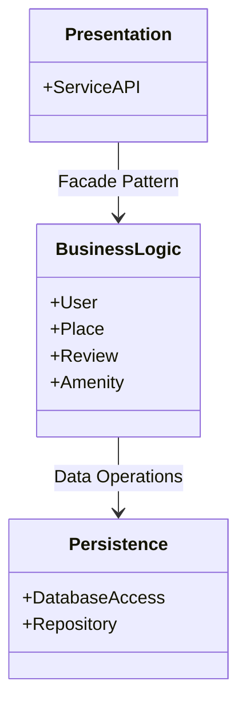
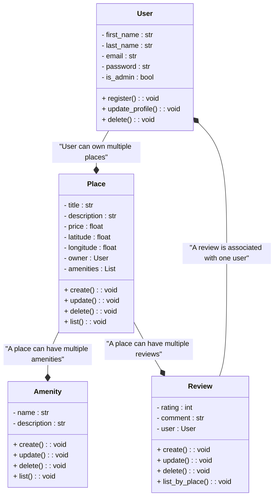
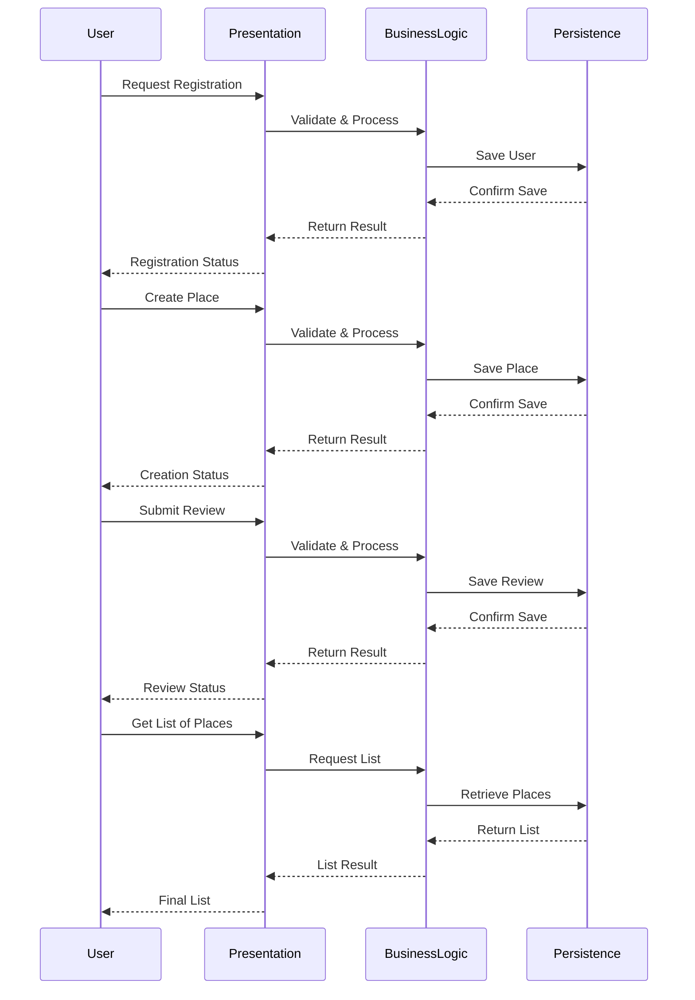

# 📘 HBnB Project Part 1 - Architecture Guide

## 📚 Introduction
This guide outlines the multi-layered architecture behind the HBnB project, describing its separation of concerns, key entities, and design principles. It provides a deep dive into how the project is organized, the role of each layer, and the reasons behind these design choices.

## 📦 Architecture Diagram
The HBnB architecture is composed of three distinct layers, making use of interfaces and design patterns for maintainability and extensibility:

### 🏗️ Layers Overview
- **Presentation**: The entry point for requests, relying on the `ServiceAPI` to communicate with the core business logic.
- **Business Logic**: Encapsulates core entities (`User`, `Place`, `Review`, `Amenity`) and enforces the application’s rules.
- **Persistence**: Manages data storage and retrieval via `DatabaseAccess` and `Repository`.

### 🧩 Main Entities
- **User**: A person using the HBnB platform.
- **Place**: A property available for listing.
- **Review**: A user-submitted review of a place.
- **Amenity**: Services or features available for places.

## 📊 Class Diagram
The HBnB project revolves around four core classes. This diagram captures their structure, responsibilities, and connections:

### 👤 User
- **Responsibility**: Manage user information and lifecycle.
- **Attributes**: `first_name`, `last_name`, `email`, `password`, `is_admin`
- **Methods**: `register()`, `update_profile()`, `delete()`
- **Relations**: Owner of one or more `Place` instances.

### 🏠 Place
- **Responsibility**: Model a place available for listing.
- **Attributes**: `title`, `description`, `price`, `latitude`, `longitude`, `owner`
- **Methods**: `create()`, `update()`, `delete()`, `list()`
- **Relations**: 
  - Owned by a `User`.
  - Associated with `Amenity`.
  - Associated with `Review`.

### 🛠️ Amenity
- **Responsibility**: Model facilities and services available for a place.
- **Attributes**: `name`, `description`
- **Methods**: `create()`, `update()`, `delete()`, `list()`
- **Relations**: Shared across multiple places.

### ⭐ Review
- **Responsibility**: Model user reviews for places.
- **Attributes**: `rating`, `comment`, `user`
- **Methods**: `create()`, `update()`, `delete()`, `list_by_place()`
- **Relations**: Associated with a specific place and a user.

### 🔑 Design Principles
- **Autonomous Entities**: Each class manages its own lifecycle through dedicated methods.
- **Clear Aggregation**: Relations (User ➔ Place ➔ Review) enable easy traversal of data.
- **Future-proof**: The structure allows new features to be added with minimal changes.

## 🔄 Sequence Diagram
Here’s an example flow for common API interactions within HBnB:

## 📝 Diagram Details
**Participants**:
- **User**: Client initiating requests.
- **Presentation**: Processes requests and returns responses.
- **BusinessLogic**: Validates requests and applies rules.
- **Persistence**: Manages database interactions.

**Key API Operations**:
1. **Register User**: Captures user information and saves it.
2. **Create Place**: Enables listing a new place.
3. **Submit Review**: Captures review details and links to a place.
4. **List Places**: Retrieves available places for listing.

Each sequence captures the complete flow—from request initiation, through validations, to database storage and final response.

## 🏁 Conclusion
This document provides an in-depth view of the HBnB project’s structure and data flow. Its layered design allows for separation of concerns, making the system maintainable, extensible, and resilient. By relying on clearly defined interfaces and entity methods, HBnB ensures a robust foundation for future growth and feature expansion.
